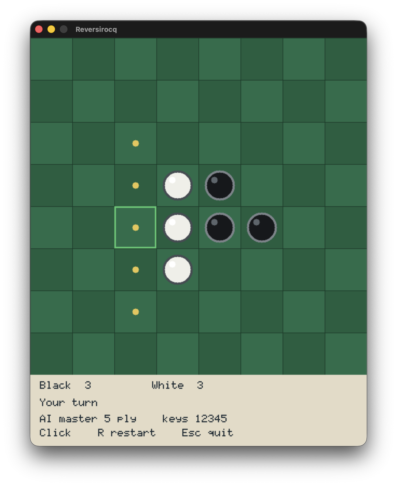

# Reversirocq

Reversirocq is a Reversi game written in Rocq and extracted to C++ with [Crane](https://github.com/bloomberg/crane). It uses the [rocq-crane-sdl2](https://github.com/joom/rocq-crane-sdl2) bindings submodule for SDL2 rendering, input, and audio, and the bundled [game-trees](https://github.com/bloomberg/game-trees) submodule for the Reversi rules and alpha-beta game-tree AI.

The user plays black. The computer plays white.



## Features

- Reversi game loop written in Rocq
- extraction to C++ with Crane
- SDL2 rendering
- mouse and keyboard controls
- valid-move hints on the board
- cursor highlight that turns green for valid moves and red for invalid moves
- tap sound when pieces are placed
- AI opponent using the `game-trees` Reversi formalization
- coinductive, depth-limited alpha-beta search for the computer player
- selectable AI difficulty levels
- SDL event draining during long AI turns so macOS does not treat the window as unresponsive

## Requirements

You need:

- Rocq with `dune`
- a C++23 compiler
- `pkg-config`
- SDL2
- SDL2_image
- SDL2_mixer

## Getting Started

Clone the repo with everything it needs:

```bash
git clone --recurse-submodules https://github.com/joom/reversirocq.git
cd reversirocq
```

If you already cloned it without submodules, run:

```bash
git submodule update --init --recursive
```

The important submodules are:

- [`crane/`](./crane): Crane extraction to C++
- [`rocq-crane-sdl2/`](./rocq-crane-sdl2): SDL2 bindings used by the extracted game
- [`game-trees/`](./game-trees): game-tree definitions, Reversi rules, and alpha-beta search

## Installing Dependencies

### macOS

Install the SDL packages with Homebrew:

```bash
brew install sdl2 sdl2_image sdl2_mixer
```

If you want to use Homebrew LLVM instead of the system toolchain:

```bash
brew install llvm
```

The Makefile automatically prefers Homebrew `clang++` when it is available.

### Linux

The exact package names vary by distribution, but you generally need:

```bash
sudo apt install clang pkg-config libsdl2-dev libsdl2-image-dev libsdl2-mixer-dev
```

### opam

If you want to build the Rocq development through opam, pin the local Crane and SDL2 binding submodules first:

```bash
opam pin add rocq-crane ./crane
opam pin add rocq-crane-sdl2 ./rocq-crane-sdl2
```

Then install the package from the current checkout:

```bash
opam install .
```

## Building

Build the game:

```bash
make
```

This does six things:

1. uses the local Crane checkout in `./crane`
2. builds and installs the local [`rocq-crane-sdl2`](./rocq-crane-sdl2) submodule
3. builds the Reversi/game-tree Rocq dependencies from [`game-trees`](./game-trees)
4. extracts [`theories/Reversirocq.v`](./theories/Reversirocq.v) to C++
5. copies the generated C++ into `src/generated/`
6. compiles the final executable `./reversirocq`

Build with a different optimization level:

```bash
make OPT=-O3
```

Run only the extraction step:

```bash
make extract
```

Run the Dune package check:

```bash
make check
```

## Running

Run the game:

```bash
make run
```

or:

```bash
./reversirocq
```

Controls:

- mouse motion: move the hover cursor
- left click: place a black disk if the hovered square is legal
- arrow keys or `WASD`: move the keyboard cursor
- `Space` or `Return`: place at the keyboard cursor
- `1`: easy AI, 1-ply search
- `2`: normal AI, 2-ply search
- `3`: hard AI, 3-ply search
- `4`: expert AI, 4-ply search
- `5`: master AI, 5-ply search
- `R`: restart
- `Q` or `Esc`: quit

While the computer is thinking, normal mouse and keyboard events are intentionally discarded. `Esc` and window close are preserved so the game can quit after the current AI search boundary.

## Gameplay Notes

The game follows standard Reversi rules:

- black moves first
- a move is legal when it places a disk on an empty square and flips at least one contiguous line of opponent disks
- a player with no legal moves passes automatically
- the game ends after both players have no legal moves, or when no further play is possible
- the player with more disks wins

The yellow hint dots show legal moves for the user. The cursor frame is green when the selected square is a legal move, red when it is not, and yellow when the user cannot currently move.

The status bar shows the current disk counts, whose turn it is, and the selected AI level. The computer uses the same alpha-beta evaluator for every difficulty; higher levels simply search more plies.

## Cleaning

Remove build outputs:

```bash
make clean
```

This removes:

- `./reversirocq`
- `./src/generated/`
- `./reversirocq.dSYM`
- Dune build outputs

## Repository Structure

```text
.
├── assets/
│   ├── screenshot.png       README screenshot
│   └── tap.mp3              disk placement sound
├── crane/                   Crane submodule used for extraction
├── game-trees/              game-tree library and Reversi formalization
├── rocq-crane-sdl2/         SDL2 bindings submodule used by extraction
├── src/
│   └── generated/           extracted C++ build artifacts
├── theories/
│   ├── Reversirocq.v        game UI, SDL loop, AI integration, extracted main
│   └── dune                 Rocq theory stanza
├── Makefile                 extraction and native build entrypoint
├── dune-project             Dune project file
├── reversirocq.opam         opam package metadata
└── README.md
```

Generated files are written to:

```text
src/generated/
```

These are build artifacts and should not be edited manually.

## What Is Proved

Most of the game-rule and AI reasoning lives in the [`game-trees`](./game-trees) submodule. In particular, [`game-trees/theories/Reversi.v`](./game-trees/theories/Reversi.v) contains the Reversi board representation, move legality, executable move application, game-result computation, and the Reversi-specific AI interface used by this game. It includes proofs about basic rule properties such as board lengths, legal move enumeration, move completeness, terminal results, deterministic results, and connections between the Reversi transition system and the game-tree construction.

The generic alpha-beta development lives in [`game-trees/theories/AlphaBeta.v`](./game-trees/theories/AlphaBeta.v). It contains the ordinary alpha-beta evaluator, the coinductive depth-limited evaluator used for lazy game-tree search, and correctness theorems relating alpha-beta evaluation to minimax evaluation on the finite prefix inspected by the search.

The top-level [`theories/Reversirocq.v`](./theories/Reversirocq.v) is mostly the executable SDL-facing game: rendering, input handling, difficulty selection, sound triggering, and the extracted `main`. It does not try to verify SDL, Crane, the generated C++, or the native SDL runtime.

## Development Notes

- The authoritative game and UI logic lives in Rocq, not in the generated C++.
- The build expects Crane at [`crane/`](./crane).
- The build expects the SDL2 bindings at [`rocq-crane-sdl2/`](./rocq-crane-sdl2).
- The build expects the Reversi/game-tree library at [`game-trees/`](./game-trees).
- [`game-trees`](./game-trees) has a local Dune theory named `GameTrees`, used by [`theories/dune`](./theories/dune).
- [`rocq-crane-sdl2/src/sdl_helpers.h`](./rocq-crane-sdl2/src/sdl_helpers.h) is the handwritten C++ SDL integration layer used by extraction.
- The responsive AI path uses `sdl_drain_events sdl_keep_quit_and_escape` from `rocq-crane-sdl2` so the SDL queue is drained during long searches without replaying stale clicks.
- The extracted program defines its own `main`, so there is no separate handwritten `main.cpp`.
- The Makefile removes the nested `rocq-crane-sdl2/crane` checkout during extraction so the build consistently uses the top-level [`crane/`](./crane) submodule.
